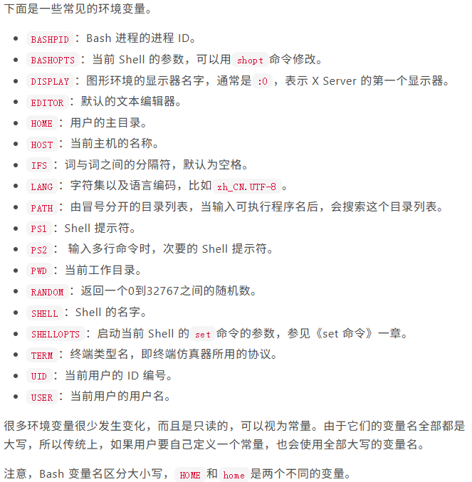

# Shell 变量基础

## 1. 简介
bash变量分为环境变量和自定义变量两种

### 1.1 环境变量
env 或者 printenv 命令，可以显示所有环境变量
```bash
env
# 或者
printenv

# 运行该指令可以直接查看
cd ./01-variables/Shell
bash 001.sh
```
- [查询全部环境变量](./Shell/001.sh)



查看单个环境变量的值，可以使用 printenv 或 echo 命令
```bash
# 例如查询 PATH
printenv $PATH
# 或者
echo $PATH

# 运行该指令可以直接查看
cd ./01-variables/Shell
bash 002.sh
```
- [查询单个环境变量](./Shell/002.sh)

